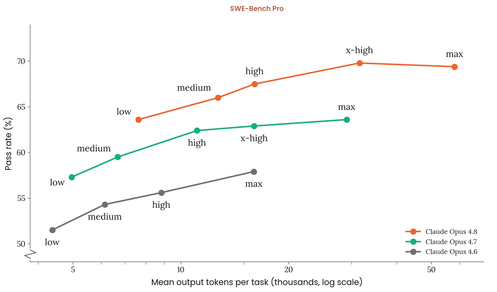

# More reasoning helps on average. Individual traces are not monotonic.

The figure above is the thing that made me curious. It is not direct evidence for the mechanism in this post.

It shows a case where a model spends more tokens and gets a lower pass rate. That could happen for many reasons: benchmark noise, scaffold details, inference settings, task distribution, or something else entirely. So I do not want to use it as evidence that "thinking longer makes models worse."

The narrower question I wanted to ask was:

> When a model writes a long reasoning trace, does the answer implied by the trace improve monotonically?

The answer, at least in these runs, seems to be no.

More reasoning helps on average. But individual reasoning traces are not monotonic. A trace can pass through a point where the model's next-token distribution favors the correct answer, then continue reasoning and end with the wrong answer.

I am tempted to call the interesting version of this "fragile correctness": the model briefly reaches a locally answerable state, then its own later reasoning destabilizes or overrides the answer. But that is a hypothesis, not a conclusion. There is an important null hypothesis: maybe these intermediate correct answers are just uncertainty, answer-letter priors, or argmax noise in a nearly tied distribution.

The rest of this post is about the evidence that the pattern is worth studying, while keeping that null in view.

## The probe

We used Gemma 4 12B on long reasoning traces for MMLU-Pro and GPQA Diamond.

For each question, the procedure is:

1. Generate a full reasoning trace and final answer.
2. Slice the generated reasoning into deciles: 0%, 10%, 20%, ..., 100%.
3. For each prefix, put the original question plus that reasoning prefix back into the model.
4. Instead of asking for a new explanation, look at the next-token probabilities over answer letters.

So a trace becomes a trajectory: at each point in the reasoning, how much does the model's immediate answer distribution favor each option?

This is not a perfect window into the model's beliefs. Reinserting a prefix is an intervention. Answer letters have priors. A one-token probe is a very small interface to a large internal state. Still, it gives a useful operational question: if we stopped the model here and forced it to answer, what would it most likely say?

## The average story still favors reasoning

The first result is the boring-but-important one: more reasoning helps a lot on average.

| Dataset | 0% probe | 90% probe | 100% probe | Broad losses |
| --- | ---: | ---: | ---: | ---: |
| MMLU-Pro | 16.8% | 75.1% | 73.1% | 122 / 1000 |
| GPQA Diamond | 27.8% | 61.6% | 56.1% | 57 / 198 |

On MMLU-Pro, aggregate accuracy rises from 16.8% with no generated reasoning prefix to 75.1% at the 90% prefix, then ends at 73.1% at the final 100% probe.

On GPQA Diamond, aggregate accuracy rises from 27.8% to 61.6% at 90%, then ends at 56.1%.

So this is not an anti-reasoning result. The average effect of reasoning is large and positive. The interesting thing is that the trajectory is not simply "more tokens, closer to the answer" all the way down.

I am using "broad loss" for traces where some intermediate probe is correct but the final probe is wrong. This is intentionally broad. It catches the phenomenon I care about, but it also catches many cases that may not be meaningful.

There are 122 broad losses out of 1000 MMLU-Pro questions and 57 out of 198 GPQA Diamond questions.

Those counts are not, by themselves, strong evidence for fragile correctness.

## The obvious skeptical explanation

Suppose the model is unsure between two answer letters. At one prefix, the correct answer is barely on top. A little later, the wrong answer is barely on top. The argmax changed, but nothing deep happened. The model did not "know" the answer and then lose it. We just looked at a noisy boundary.

That explanation should be taken seriously. In fact, I think it is the default explanation for many broad losses.

This is why I do not want to say "we found cases where the model reasoned itself out of the right answer" and stop there. The right question is whether broad-loss questions behave differently from matched controls when rerun, and whether early trajectory features predict later loss better than simple confidence does.

## Do losses recur?

To probe the null, we looked at matched-control recurrence. The rough idea is:

- Take questions that showed a seed-0 broad loss.
- Compare them to matched final-correct controls and stable-wrong controls.
- Rerun and ask how often the same kind of loss recurs.

If broad losses were mostly generic argmax noise, I would expect the recurrence rate to be much closer to the controls.

Instead, the broad-loss group recurs more often:

| Dataset | Seed-0 loss group | Final-correct controls | Stable-wrong controls |
| --- | ---: | ---: | ---: |
| GPQA Diamond | 46.8% | 17.6% | 16.0% |
| MMLU-Pro | 46.8% | 5.2% | 18.8% |

This does not prove fragile correctness. It does suggest that these are not all interchangeable near-ties. Some questions seem to have a recurrent tendency toward this kind of answer instability.

I find that more interesting than the raw broad-loss count. The broad count says "some intermediate argmax was correct and the final argmax was wrong." The recurrence result says "the questions selected by this pattern are unusually likely to show it again."

## Does this survive confidence filters?

The broad-loss definition is deliberately weak, so I reran the recurrence analysis with stricter filters.

In the strictest version, a qualified loss must have:

- a pre-final checkpoint where the normalized probability on the correct answer is at least 0.9;
- a wrong final answer where the normalized probability on the final predicted answer is also at least 0.9.

This is still not proof that the model "knew" the answer. But it removes many cases where the correct answer was only barely the argmax, or where the final answer-letter probe had little mass on valid answers.

Under this stricter definition, the recurrence gap shrinks but does not disappear:

| Dataset | Seed-0 loss group | Final-correct controls | Stable-wrong controls |
| --- | ---: | ---: | ---: |
| GPQA Diamond | 24.0% | 6.0% | 5.2% |
| MMLU-Pro | 25.2% | 2.0% | 6.8% |

The matched risk differences are still positive. At this strict threshold:

- GPQA Diamond: loss questions exceed final-correct controls by 18.0 percentage points, and stable-wrong controls by 18.8 points.
- MMLU-Pro: loss questions exceed final-correct controls by 23.2 points, and stable-wrong controls by 18.4 points.

This makes the simplest uncertainty-blip story less satisfying. If all we had were low-confidence near-ties, I would expect the effect to mostly vanish under a 0.9/0.9 filter. It attenuates, which is exactly what you would expect if the broad bucket contains noise, but a substantial gap remains.

## Can we see it coming?

Another check is whether the trajectory contains predictive information before the final answer.

At the 80% prefix, a confidence-only predictor gets a combined AUC of 0.718. Adding instability features raises this to 0.817.

That is not magic. It is not a reliable detector of "the model is about to overthink." But it is a meaningful gap. The shape of the trajectory appears to contain information beyond a static confidence snapshot.

This again pushes me away from the simplest version of the noise story. If the only thing happening were low confidence near the final decision boundary, then instability features should not help much after accounting for confidence. They do help, at least in the current artifacts.

## What if we had stopped earlier?

The most direct way to ask whether the correct intermediate state is useful is an early-commitment analysis.

First, I ran oracle policies. These are not deployable: they use the ground-truth answer to choose when to stop. But they tell us how much accuracy is recoverable in principle.

For the seed-0 loss cohort, stopping at the first correct checkpoint would have changed final accuracy as follows:

| Dataset | Final accuracy | Oracle first-correct | First correct with normalized probability >= 0.9 |
| --- | ---: | ---: | ---: |
| GPQA Diamond | 43.6% | 90.4% | 80.4% |
| MMLU-Pro | 45.6% | 92.4% | 82.4% |

On the broad-loss attempts within that cohort, the final accuracy is zero by definition. A 0.9 normalized-correct threshold would recover 78.6% of those attempts in both datasets.

This is good evidence that the intermediate correct states are often not just microscopic argmax accidents. In many cases, the correct answer has enough normalized probability that an oracle threshold policy could have stopped there.

But the practical version is much less solved. I also tried a simple non-oracle proxy: stop when the predicted answer has normalized probability at least 0.9 and has stayed the same for two checkpoints. This policy barely improves the seed-0 loss cohort overall:

| Dataset | Final accuracy | Confidence-streak proxy |
| --- | ---: | ---: |
| GPQA Diamond loss cohort | 43.6% | 44.0% |
| MMLU-Pro loss cohort | 45.6% | 47.2% |

And it hurts some controls: for example, MMLU-Pro final-correct controls drop from 86.4% to 82.0%, and GPQA stable-wrong controls drop from 21.6% to 5.2%.

So the upper bound is large, but a naive stopping rule is bad. That seems like the right state of affairs for a preliminary result: there is recoverable signal, but not yet a useful intervention.

## What might be happening?

I see a few live possibilities.

One is the boring null: the model is uncertain, the top answer changes, and our one-token probe turns smooth uncertainty into discrete wins and losses.

Another is that long reasoning sometimes introduces a false constraint, a tempting distractor, or a bad self-generated premise. The model has enough evidence to answer correctly at one point, but later text changes the local computation in a worse direction.

A third is that the probe itself creates artifacts. The model is being asked to answer after a prefix that was originally part of a longer continuation. That is not the same as the model naturally deciding to stop there.

My current guess is that all three are present. The broad-loss bucket is too heterogeneous to deserve a single story. The thing worth isolating is the subset that is recurrent, predictable from trajectory instability, and visible in the qualitative trace.

That subset is what I would want "fragile correctness" to refer to, if the term survives contact with examples.

## Qualitative examples

Here are two examples that made the phenomenon feel more concrete to me. They are illustrations, not proof.

The first is a MMLU-Pro logical-fallacies question:

> Arguing that someone couldn't have done something good because she holds a particular position commits the fallacy of...

The correct answer is `C`, "reprehensible personality". The final probe and the generated answer are both `A`, "guilt by association".

This is a robust lost case in the current analysis. The model is first correct at the 10% prefix and last correct at the 60% prefix. The peak raw probability on the correct answer is 0.998, and the final valid-letter probability mass is 0.994. So this is not a case where the final answer-letter probe has almost no mass on valid answers.

My paraphrase of the trace is: early reasoning maps the prompt to an attack on the person; later reasoning reframes "holds a particular position" as association with a group, and the answer moves to guilt by association. That does not prove that the model "knew" the answer. But it is at least a cleaner example than a barely-correct argmax in a flat distribution.

The second is a GPQA Diamond organic chemistry question about an enamine/enaminium reaction. The correct answer is `C`; the final probe and generated answer are `B`. The model is correct as late as the 80% prefix, then ends wrong. The trace has six adjacent-decile prediction flips and about 25k reasoning tokens.

This one is less accessible if you are not comfortable with organic chemistry, but it is qualitatively vivid. The trace repeatedly redraws the structure, loses track of carbon counting, and circles around which carbon is alkylated before selecting the wrong product. Here the peak correct-answer probability is only 0.560, so I would not use it as strong evidence against the uncertainty explanation. I would use it as an example of the kind of unstable reasoning that the aggregate tables compress away.

There are also messier examples. One MMLU-Pro business question is correct at the 90% prefix and then flips to a nearby wrong interest-rate option at the end. One GPQA symmetry question has final valid-letter mass 0.998 and generated/probed agreement on the wrong answer. I would not want to build the argument on any one of these traces, but they are useful sanity checks: the broad-loss bucket contains both boring uncertainty-looking cases and cases where the late trace seems to introduce a bad reframing or bookkeeping error.

This is why I think the next step should be thresholded and interventional rather than just more examples. If "fragile correctness" is real, it should survive stricter confidence filters and it should be possible to recover some answers by stopping or branching from high-risk checkpoints.

## Next experiments

The most important next experiment is branching. When a trace is currently correct but unstable, continue it several ways: normal continuation, answer-only commitment, short verification, and perhaps a prompt that asks the model to preserve its current answer unless it finds a decisive contradiction. If branching rescues many cases, then "locally recoverable but unstable" becomes a more useful description than "argmax noise."

I also want a better non-oracle stopping policy. The simple confidence-streak rule above stops too aggressively. A more plausible policy should combine current confidence with trajectory instability: flips so far, confidence decline, time since first correct, and whether the current answer has stabilized.

## Why I care

The usual summary of long reasoning is average performance. That is the number we should care about for many practical purposes, and in these runs it says reasoning helps.

But average performance hides the dynamics inside individual traces. A model can improve dramatically in aggregate while some individual traces wander into and out of correct-answer regions.

That matters if we want to build monitors for reasoning, decide when to stop generation, or understand whether a model's explanation is accumulating evidence or merely producing text that sometimes helps and sometimes hurts.

The main claim I would make today is modest:

> More reasoning helps on average, but individual reasoning traces are not monotonic.

The stronger claim is still open:

> Some models may exhibit fragile correctness: states where the answer is locally recoverable, but later reasoning reliably makes it worse.

The current results do not establish the stronger claim. They make it worth investigating.
