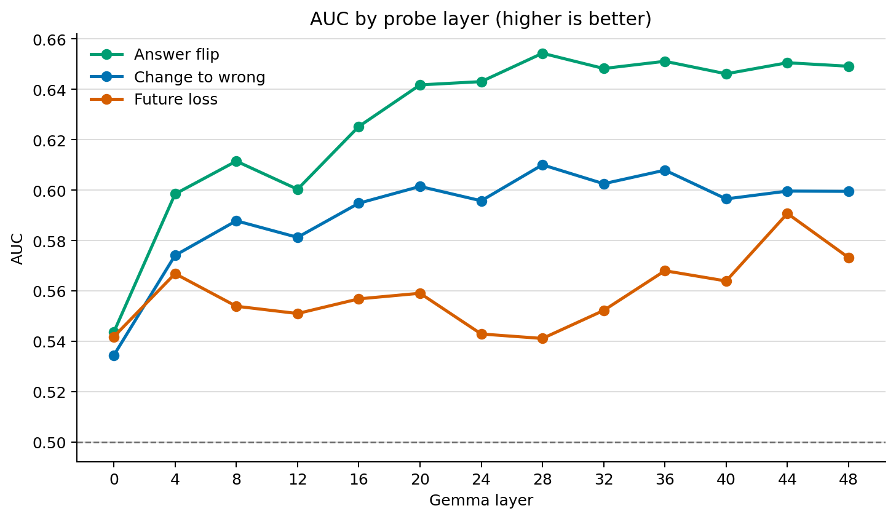
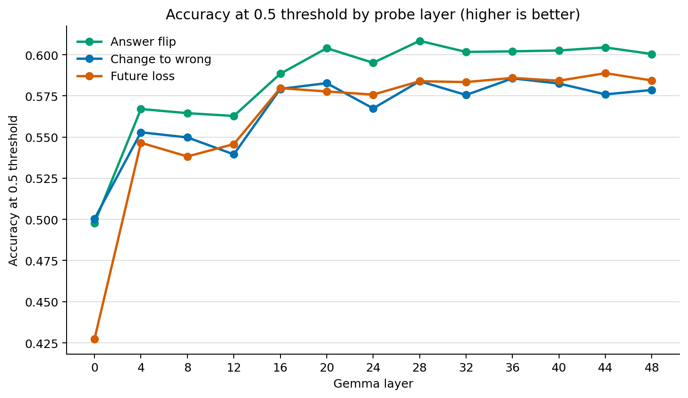
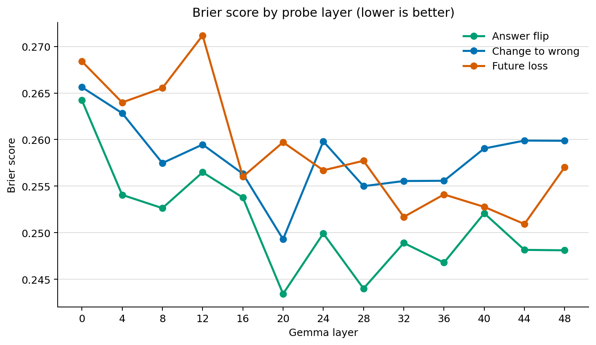
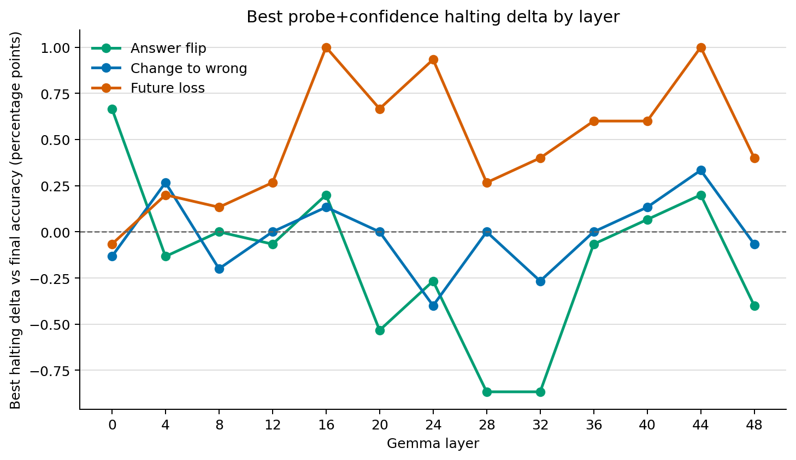

# Activation Probe Report

- Examples: 13,500
- Layers: 0, 4, 8, 12, 16, 20, 24, 28, 32, 36, 40, 44, 48
- Targets: future_loss, future_change_to_wrong, future_answer_flip
- Backend: torch

## Targets

- `future_loss`: Current prediction is correct and the final prediction is wrong.
- `future_change_to_wrong`: The final prediction is wrong and differs from the current prediction.
- `future_answer_flip`: The final prediction differs from the current prediction.

## Best AUC

| Target | Layer | AUC | Brier | Positive rate |
|---|---:|---:|---:|---:|
| `future_answer_flip` | 28 | 0.654 | 0.244 | 29.2% |
| `future_answer_flip` | 36 | 0.651 | 0.247 | 29.2% |
| `future_answer_flip` | 44 | 0.651 | 0.248 | 29.2% |
| `future_answer_flip` | 48 | 0.649 | 0.248 | 29.2% |
| `future_answer_flip` | 32 | 0.648 | 0.249 | 29.2% |
| `future_change_to_wrong` | 28 | 0.610 | 0.255 | 18.4% |
| `future_change_to_wrong` | 36 | 0.608 | 0.256 | 18.4% |
| `future_change_to_wrong` | 32 | 0.603 | 0.256 | 18.4% |
| `future_change_to_wrong` | 20 | 0.601 | 0.249 | 18.4% |
| `future_change_to_wrong` | 44 | 0.600 | 0.260 | 18.4% |
| `future_loss` | 44 | 0.591 | 0.251 | 8.0% |
| `future_loss` | 48 | 0.573 | 0.257 | 8.0% |
| `future_loss` | 36 | 0.568 | 0.254 | 8.0% |
| `future_loss` | 4 | 0.567 | 0.264 | 8.0% |
| `future_loss` | 40 | 0.564 | 0.253 | 8.0% |

## Best Halting Deltas

| Target | Layer | Confidence | Probe | Accuracy | Delta vs final | Stop rate |
|---|---:|---:|---:|---:|---:|---:|
| `future_loss` | 16 | 0.95 | 0.70 | 49.5% | +1.0% | 50.9% |
| `future_loss` | 44 | 0.70 | 0.90 | 49.5% | +1.0% | 9.4% |
| `future_loss` | 24 | 0.95 | 0.70 | 49.5% | +0.9% | 49.9% |
| `future_loss` | 44 | 0.80 | 0.90 | 49.4% | +0.9% | 8.7% |
| `future_loss` | 44 | 0.90 | 0.90 | 49.3% | +0.8% | 7.9% |
| `future_answer_flip` | 0 | 0.95 | 0.70 | 49.2% | +0.7% | 31.3% |
| `future_change_to_wrong` | 44 | 0.95 | 0.90 | 48.9% | +0.3% | 7.6% |
| `future_change_to_wrong` | 4 | 0.90 | 0.90 | 48.8% | +0.3% | 3.1% |
| `future_change_to_wrong` | 44 | 0.90 | 0.90 | 48.8% | +0.3% | 8.8% |
| `future_change_to_wrong` | 4 | 0.70 | 0.90 | 48.8% | +0.3% | 3.8% |
| `future_change_to_wrong` | 4 | 0.80 | 0.90 | 48.8% | +0.3% | 3.7% |
| `future_answer_flip` | 16 | 0.95 | 0.90 | 48.7% | +0.2% | 9.9% |
| `future_answer_flip` | 44 | 0.95 | 0.90 | 48.7% | +0.2% | 10.7% |
| `future_answer_flip` | 16 | 0.90 | 0.90 | 48.6% | +0.1% | 11.5% |
| `future_answer_flip` | 40 | 0.95 | 0.90 | 48.6% | +0.1% | 14.1% |

## Plots

