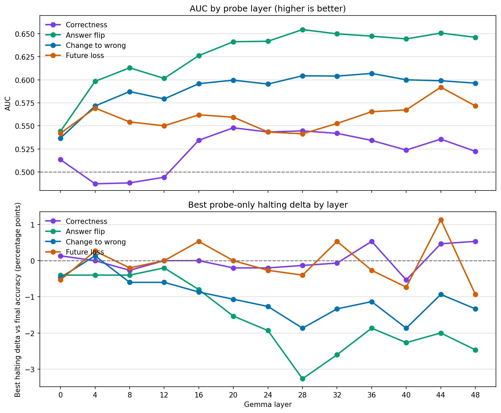
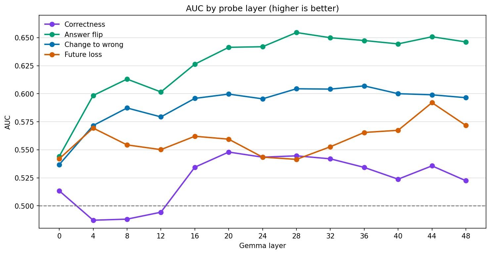
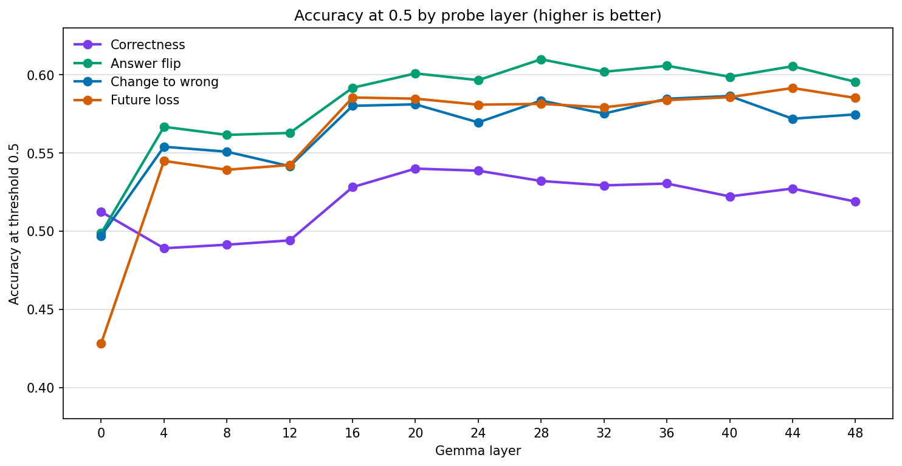
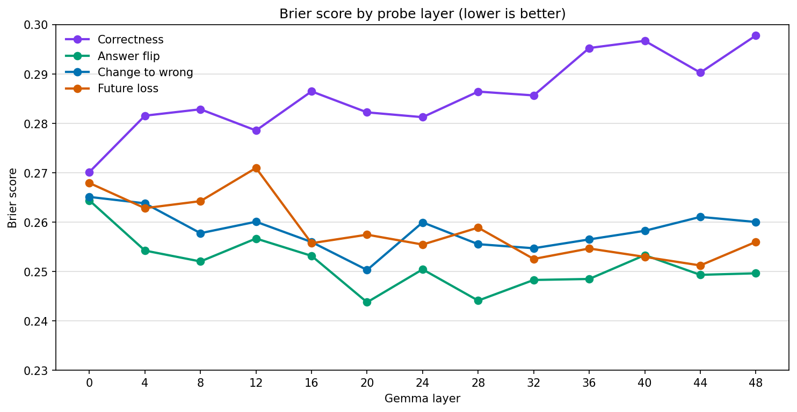
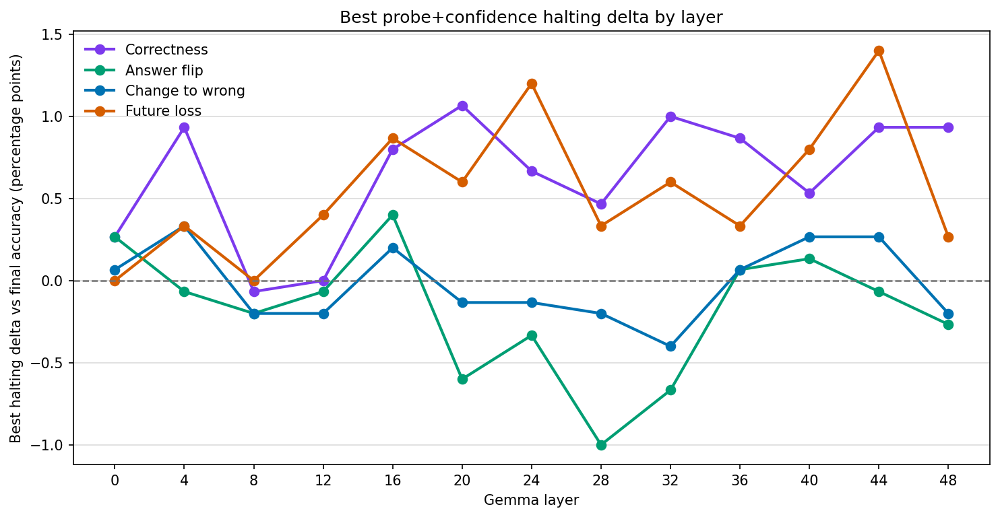
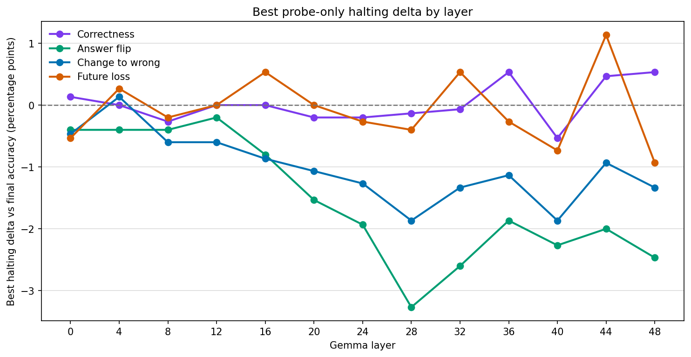

# Activation Probe Report

- Examples: 13,500
- Layers: 0, 4, 8, 12, 16, 20, 24, 28, 32, 36, 40, 44, 48
- Targets: current_correct, future_loss, future_change_to_wrong, future_answer_flip
- Backend: torch

## Targets

- `current_correct`: The current prediction matches the true answer.
- `future_loss`: Current prediction is correct and the final prediction is wrong.
- `future_change_to_wrong`: The final prediction is wrong and differs from the current prediction.
- `future_answer_flip`: The final prediction differs from the current prediction.

## Best AUC

| Target | Layer | AUC | Brier | Positive rate |
|---|---:|---:|---:|---:|
| `future_answer_flip` | 28 | 0.655 | 0.244 | 29.2% |
| `future_answer_flip` | 44 | 0.651 | 0.249 | 29.2% |
| `future_answer_flip` | 32 | 0.650 | 0.248 | 29.2% |
| `future_answer_flip` | 36 | 0.647 | 0.248 | 29.2% |
| `future_answer_flip` | 48 | 0.646 | 0.250 | 29.2% |
| `future_change_to_wrong` | 36 | 0.607 | 0.256 | 18.4% |
| `future_change_to_wrong` | 28 | 0.604 | 0.256 | 18.4% |
| `future_change_to_wrong` | 32 | 0.604 | 0.255 | 18.4% |
| `future_change_to_wrong` | 40 | 0.600 | 0.258 | 18.4% |
| `future_change_to_wrong` | 20 | 0.600 | 0.250 | 18.4% |
| `future_loss` | 44 | 0.592 | 0.251 | 8.0% |
| `future_loss` | 48 | 0.572 | 0.256 | 8.0% |
| `future_loss` | 4 | 0.569 | 0.263 | 8.0% |
| `future_loss` | 40 | 0.567 | 0.253 | 8.0% |
| `future_loss` | 36 | 0.565 | 0.255 | 8.0% |
| `current_correct` | 20 | 0.548 | 0.282 | 45.7% |
| `current_correct` | 28 | 0.545 | 0.286 | 45.7% |
| `current_correct` | 24 | 0.543 | 0.281 | 45.7% |
| `current_correct` | 32 | 0.542 | 0.286 | 45.7% |
| `current_correct` | 44 | 0.536 | 0.290 | 45.7% |

## Best Halting Deltas

| Target | Policy | Layer | Confidence | Probe | Accuracy | Delta vs final | Stop rate |
|---|---|---:|---:|---:|---:|---:|---:|
| `future_loss` | probe_confidence | 44 | 0.80 | 0.90 | 49.9% | +1.4% | 9.1% |
| `future_loss` | probe_confidence | 44 | 0.90 | 0.90 | 49.9% | +1.4% | 8.1% |
| `future_loss` | probe_confidence | 44 | 0.70 | 0.90 | 49.9% | +1.4% | 9.7% |
| `future_loss` | probe_confidence | 44 | 0.95 | 0.90 | 49.7% | +1.2% | 7.2% |
| `future_loss` | probe_confidence | 24 | 0.95 | 0.70 | 49.7% | +1.2% | 49.4% |
| `current_correct` | probe_confidence | 20 | 0.90 | 0.70 | 49.6% | +1.1% | 63.7% |
| `current_correct` | probe_confidence | 32 | 0.95 | 0.70 | 49.5% | +1.0% | 62.1% |
| `current_correct` | probe_confidence | 48 | 0.90 | 0.90 | 49.5% | +0.9% | 20.7% |
| `current_correct` | probe_confidence | 44 | 0.70 | 0.90 | 49.5% | +0.9% | 19.3% |
| `current_correct` | probe_confidence | 4 | 0.90 | 0.70 | 49.5% | +0.9% | 43.5% |
| `future_answer_flip` | probe_confidence | 16 | 0.95 | 0.90 | 48.9% | +0.4% | 10.6% |
| `future_change_to_wrong` | probe_confidence | 4 | 0.70 | 0.90 | 48.9% | +0.3% | 3.9% |
| `future_change_to_wrong` | probe_confidence | 4 | 0.80 | 0.90 | 48.9% | +0.3% | 3.9% |
| `future_change_to_wrong` | probe_confidence | 4 | 0.90 | 0.90 | 48.9% | +0.3% | 3.2% |
| `future_answer_flip` | probe_confidence | 16 | 0.90 | 0.90 | 48.9% | +0.3% | 11.9% |
| `future_change_to_wrong` | probe_confidence | 40 | 0.95 | 0.90 | 48.8% | +0.3% | 9.7% |
| `future_change_to_wrong` | probe_confidence | 44 | 0.95 | 0.90 | 48.8% | +0.3% | 8.0% |
| `future_answer_flip` | probe_confidence | 0 | 0.95 | 0.70 | 48.8% | +0.3% | 30.3% |
| `future_answer_flip` | probe_confidence | 16 | 0.80 | 0.90 | 48.7% | +0.2% | 13.9% |
| `future_answer_flip` | probe_confidence | 40 | 0.95 | 0.90 | 48.7% | +0.1% | 13.9% |

## Best Probe-Only Halting Deltas

| Target | Layer | Probe | Accuracy | Delta vs final | Stop rate |
|---|---:|---:|---:|---:|---:|
| `future_loss` | 44 | 0.90 | 49.7% | +1.1% | 11.4% |
| `current_correct` | 48 | 0.90 | 49.1% | +0.5% | 25.4% |
| `future_loss` | 16 | 0.90 | 49.1% | +0.5% | 12.6% |
| `current_correct` | 36 | 0.90 | 49.1% | +0.5% | 22.5% |
| `future_loss` | 32 | 0.90 | 49.1% | +0.5% | 9.5% |
| `current_correct` | 44 | 0.90 | 49.0% | +0.5% | 21.0% |
| `future_loss` | 4 | 0.90 | 48.8% | +0.3% | 1.9% |
| `current_correct` | 0 | 0.90 | 48.7% | +0.1% | 3.5% |
| `future_change_to_wrong` | 4 | 0.90 | 48.7% | +0.1% | 4.7% |
| `current_correct` | 16 | 0.90 | 48.5% | +0.0% | 17.0% |
| `future_loss` | 12 | 0.90 | 48.5% | +0.0% | 5.5% |
| `future_answer_flip` | 12 | 0.90 | 48.3% | -0.2% | 3.9% |
| `future_answer_flip` | 8 | 0.90 | 48.1% | -0.4% | 3.9% |
| `future_answer_flip` | 4 | 0.90 | 48.1% | -0.4% | 5.8% |
| `future_answer_flip` | 0 | 0.90 | 48.1% | -0.4% | 5.1% |
| `future_change_to_wrong` | 0 | 0.90 | 48.1% | -0.5% | 4.8% |
| `future_change_to_wrong` | 12 | 0.90 | 47.9% | -0.6% | 3.7% |
| `future_change_to_wrong` | 8 | 0.90 | 47.9% | -0.6% | 5.7% |
| `future_answer_flip` | 16 | 0.90 | 47.7% | -0.8% | 17.6% |
| `future_change_to_wrong` | 16 | 0.90 | 47.7% | -0.9% | 12.9% |

## Plots

